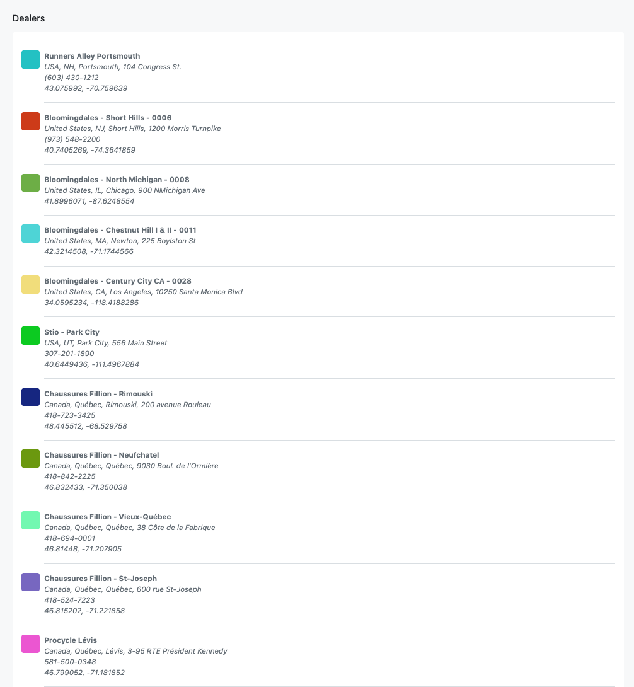
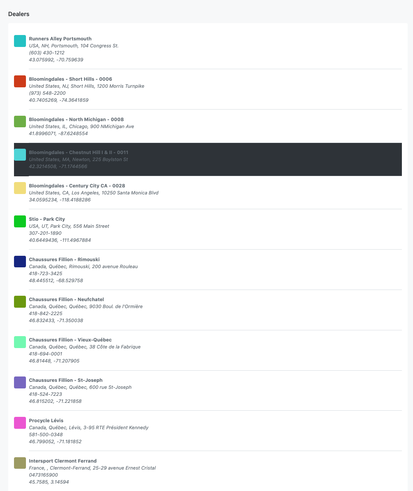

# On Dealers

#### Setup
```
 bundle install
 rename .env.sample to be .env then add the right credentials
 bundle exec rails db:reset
 bundle exec rails s # port 3000
 bundle exec rspec # to run tests
```


To import dealers from sales force there 3 ways:

* open rails console
```
rails c
RestForce::Updater.call
```

* Also there is a cheduled job to be run every 1 hour using `whenever` gem and tou can change it to the time you want
then run.
```
bundle exec whenever
``` 

* Also there is a BG job you can enqueue it or perform it from rails console
```
RestforceUpdaterJob.perform_now
```

* After that you should have data imported to your DB

#### How you can view the data?
* there is Front-End react simple app here https://github.com/ahmdelemam/on-react

if you clone this and run 
```
npm instll
npm start # on port 3001 for example
```
* go to localhost:3001 you should see something like this



